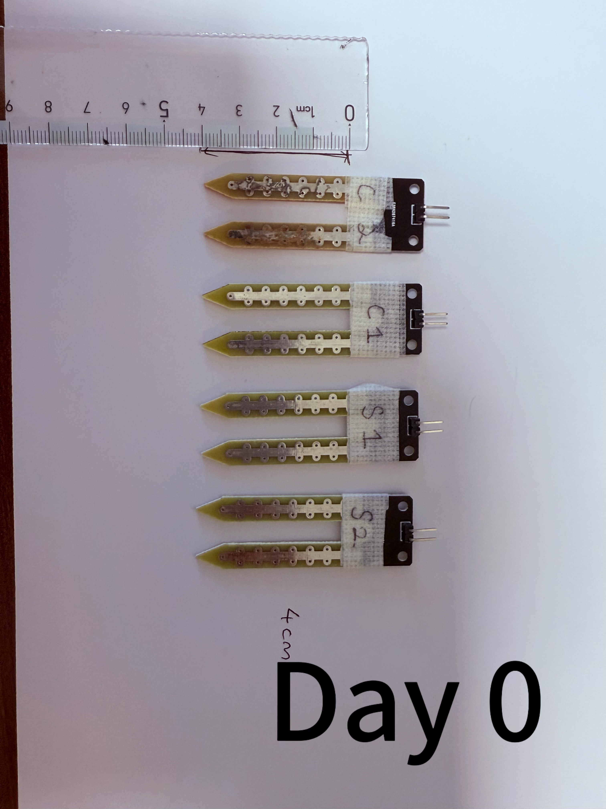
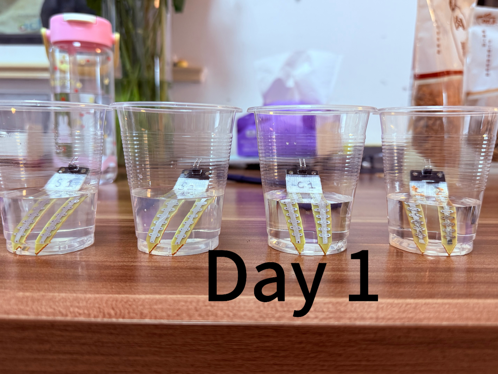
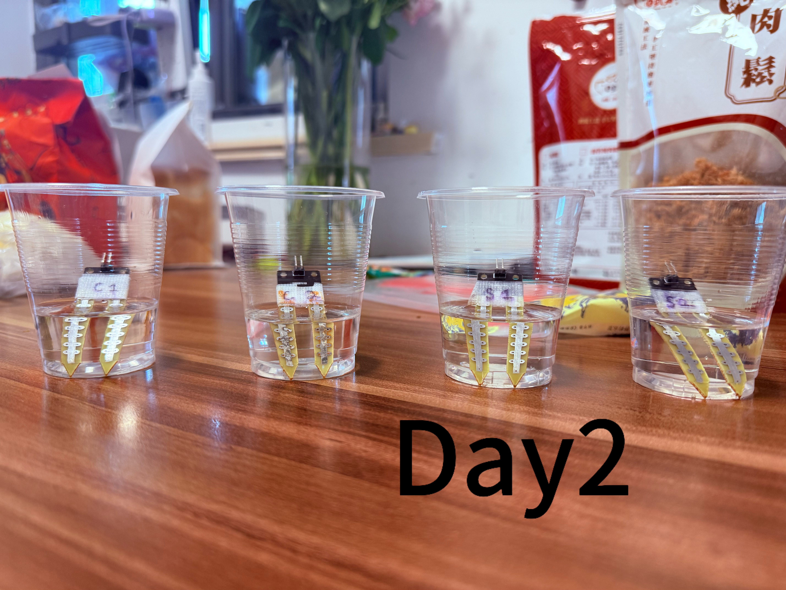
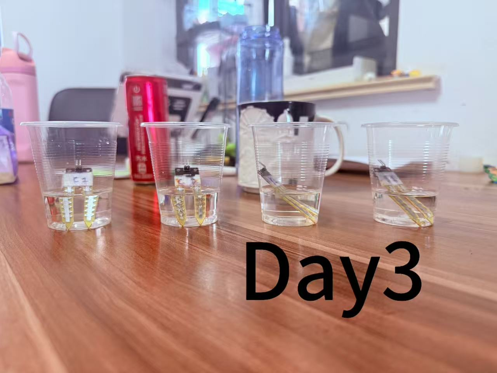
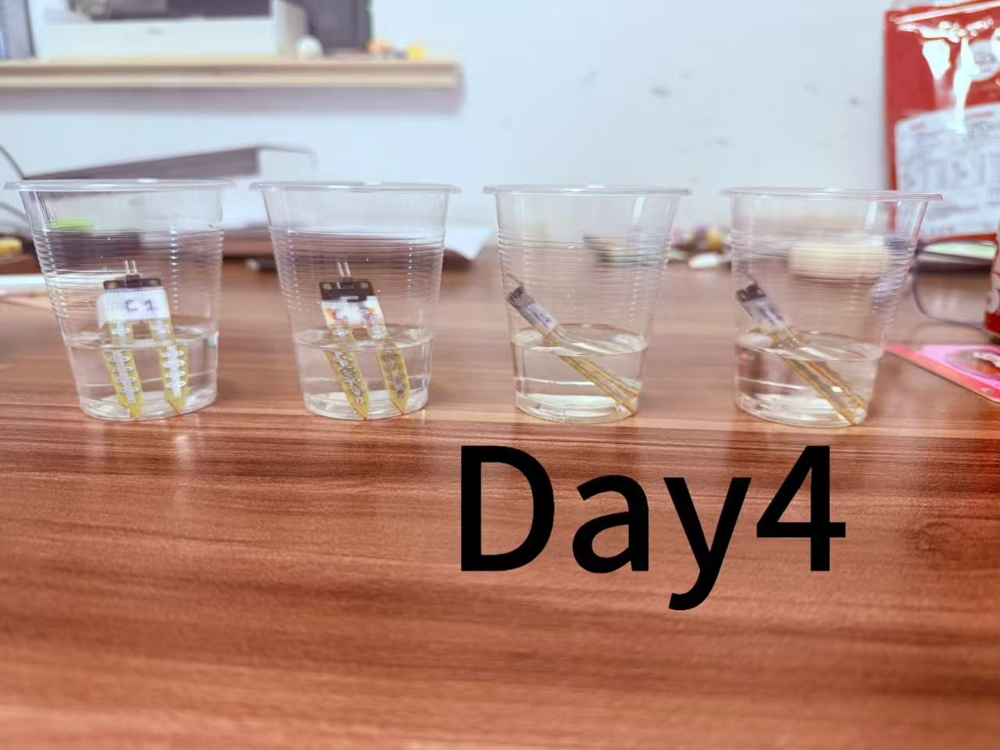
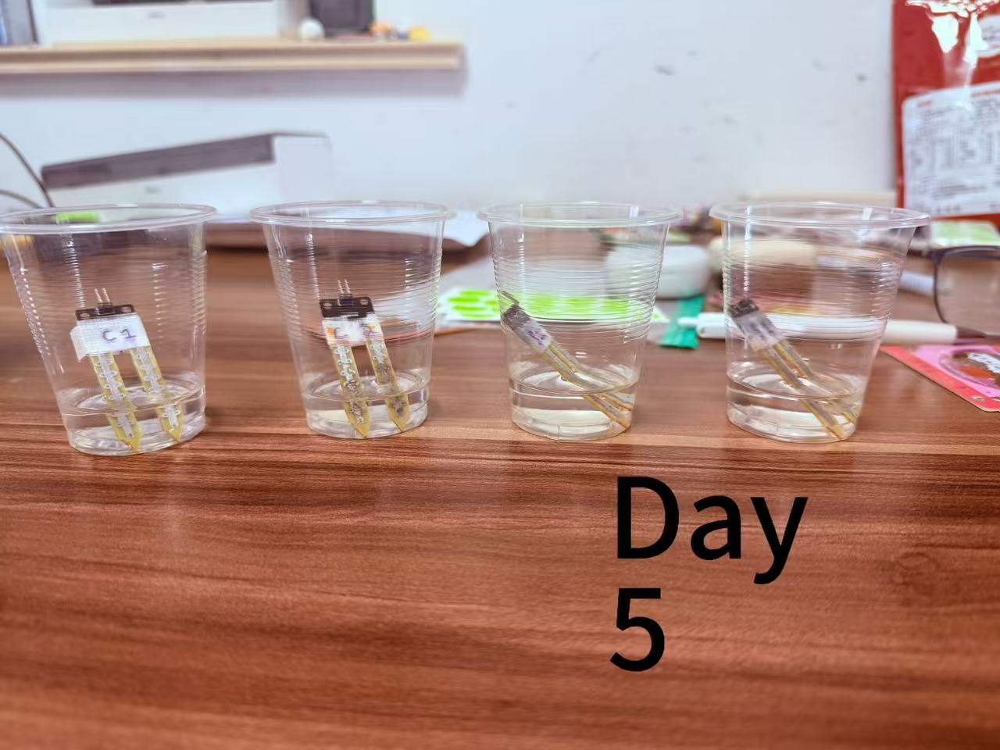

# 120-Hour Saline-Exposure Study of Resistive Soil-Moisture Sensors

**Status:** Completed
**Platform:** ESP32
**Exposure duration:** 120 hours
**Experimental groups:** 3.5% NaCl exposure and water control

## Overview

This controlled pilot study investigated whether multi-day saline exposure causes calibration drift in low-cost resistive soil-moisture sensors. Four new sensors were individually characterized before exposure. Two sensors, S1 and S2, were placed in a 3.5% NaCl solution, while C1 and C2 were placed in ordinary water as controls.

The sensors remained unpowered during the 120-hour exposure. After exposure, all probes were rinsed, dried for approximately one hour, and retested under standardized soil-moisture conditions.

## Research Question

How does 120 hours of unpowered exposure to a 3.5% sodium chloride solution affect the ADC readings and calibration responses of low-cost resistive soil-moisture sensors, compared with water-exposed control sensors?

## Experimental Design

* Saline-exposure group: S1 and S2
* Water-control group: C1 and C2
* Independent sensors per group: n = 2
* Test conditions: 0 g, 20 g, and 40 g of added water
* Technical repeats: five displayed ADC readings per sensor and condition
* ESP32 ADC pin: GPIO 33
* Sensor insertion depth: 4 cm
* Stabilization time: approximately 30 seconds
* Exposure condition: unpowered immersion for 120 hours

At the endpoint, the sensors were tested in the order C1 → S1 → S2 → C2. Within each sensor, the measurement order was 0 g → 20 g → 40 g.
## Daily Visual Record

Photographs were taken throughout the 120-hour exposure period to document possible changes in solution clarity, deposits, and electrode appearance. The photographs are qualitative supporting evidence only and were not treated as quantitative measurements of corrosion.

### Day 0 - Before Exposure

All four probes were photographed before immersion. S1 and S2 were assigned to the 3.5% NaCl exposure group, while C1 and C2 were assigned to the tap-water control group. The solutions were initially clear, and no obvious deposits or electrode discoloration were observed.

### Day 1

No obvious changes in solution color, clarity, visible deposits, or electrode appearance were observed in either group.

### Day 2

The solutions remained visually clear. No obvious macroscopic difference between the saline-exposure and tap-water-control groups was identified.

### Day 3

No visible sediment or clear change in electrode appearance was observed under the photographic conditions.

### Day 4

Both groups remained visually similar to the preceding days, with no obvious solution discoloration, deposits, or macroscopic electrode deterioration.

### Day 5 - 120-Hour Endpoint

At the 120-hour endpoint, no clear macroscopic change in liquid color, deposits, or electrode appearance was observed in either group. However, the absence of visible change does not rule out smaller surface changes or changes in sensor performance that could only be detected through post-exposure ADC testing.

## Paired ADC Results

ADC drift was calculated as:

**Drift = post-exposure mean ADC − baseline mean ADC**

| Sensor | Group           | 20 g Baseline | 20 g Post | 20 g Drift | 40 g Baseline | 40 g Post | 40 g Drift |
| ------ | --------------- | ------------: | --------: | ---------: | ------------: | --------: | ---------: |
| S1     | Saline exposure |        1009.0 |    1043.0 |      +34.0 |         658.2 |     625.0 |      −33.2 |
| S2     | Saline exposure |        1125.4 |     811.4 |     −314.0 |         848.6 |     570.4 |     −278.2 |
| C1     | Water control   |        1176.2 |     997.8 |     −178.4 |         698.8 |     684.0 |      −14.8 |
| C2     | Water control   |        1006.4 |     703.2 |     −303.2 |         718.6 |     553.2 |     −165.4 |

## Group-Level Descriptive Comparison

| Test Condition | Saline Mean Drift | Control Mean Drift |
| -------------- | ----------------: | -----------------: |
| 20 g           |        −140.0 ADC |         −240.8 ADC |
| 40 g           |        −155.7 ADC |          −90.1 ADC |

At 20 g, the water-control sensors shifted more negatively than the saline-exposed sensors. At 40 g, the saline-exposed sensors shifted more negatively. The direction of the group difference therefore reversed between the two moisture conditions.

The 0 g results were treated as descriptive only because S2, C1, and C2 reached the ESP32 ADC ceiling of 4095 at baseline, preventing precise dry-end drift estimates.

## Main Finding

ADC shifts were observed in both the saline-exposed and water-control sensors. However, the saline-versus-control difference was not consistent across the 20 g and 40 g conditions.

Therefore, this pilot study did not demonstrate a consistent additional saline-specific calibration drift after 120 hours. This result does not prove that saline exposure has no effect; it means that no consistent group-specific pattern was detected under the conditions and sample size used in this experiment.

No obvious macroscopic changes in liquid clarity, deposits, or electrode appearance were observed at the 120-hour endpoint.

## Limitations

* Only two independent sensors were tested in each group.
* Only one salt concentration and one exposure duration were investigated.
* The probes were unpowered during exposure, which does not fully represent normal powered operation.
* Several baseline 0 g readings reached the ADC ceiling.
* ADC drift and photographs cannot independently establish a specific corrosion mechanism.
* The findings are descriptive pilot evidence and should not be generalized to all resistive soil-moisture sensors.

## AI Assistance and Research Integrity

Generative AI tools were used for code assistance, methodological discussion, spreadsheet organization, calculation checking, and language editing. The physical setup, sample preparation, sensor measurements, photography, original data recording, and final verification were completed by the student.
